# Porchlight Press

**Your hometown newspaper, rebuilt for your phone. Free, private, and honest about where every story comes from.**

Porchlight Press is a free Android app that puts together a real-looking daily newspaper for the place you live. It has local, regional, state, national, and world news, plus your weather. Every story tells you where it came from and links to the original reporting.

> **Status: in development.** Porchlight Press is being built now and will launch on **Google Play**. This page describes the app we're building. Watch or star this repository to follow along.

---

## What you get

📰 **A newspaper, not a feed.** A front page with a masthead, headlines, sections, and photos, laid out like the paper that used to land on your porch. Pick a classic newsprint look or a clean modern one, in light or dark.

📍 **News for where you actually live.** Tell the app your town and it builds your paper around it: **Local**, your **region**, your **state**, the **nation**, and the **world**. You can use your phone's approximate location, type your **ZIP or postal code**, or pick your town from a list. You can also follow more than one place, like home, where your parents live, or where you're headed next week.

🌦️ **Weather built in.** Today's conditions, the forecast, and severe-weather alerts for your area, straight from the U.S. National Weather Service (and MET Norway elsewhere in the world).

🔗 **Every story shows its sources.** Stories are short, neutral briefs that list every news outlet they're based on, with a link to read the original article. We send readers *to* local journalists; we don't replace them.

🤖 **AI you can see, not AI that hides.** Briefs are written by a small AI "newsroom" and **clearly labelled as AI-written** every time. Strict checks throw out any brief that adds a name, number, quote, or fact the original sources didn't report. When a brief doesn't pass, you see the original headline and a link instead. [How the AI works →](#how-the-ai-newsroom-works)

🌍 **Read it in your language.** Choose from dozens of languages when you set up the app, or change it any time in Settings. Menus, stories, weather, and even your downloaded PDF are translated **right on your phone**.

🔊 **Have the news read to you.** Tap **Listen** on any story, or play a whole section, in a natural-sounding voice. It keeps playing with your screen off and works with headphones and car Bluetooth. You choose the voice and speed.

📄 **Download today's paper as a PDF.** Save a newspaper-style PDF of your edition to read offline, print, or share. Open it in the app's built-in reader or any PDF app you like.

📤 **Share stories easily.** Send any story to friends and family through the usual Android share menu. They get the headline, a short summary, and a link. They don't need the app to read it.

✈️ **Works offline.** Your latest paper and saved stories stay readable without a connection.

🔔 **Notifications you control.** Severe-weather warnings, breaking local news, and morning and evening editions are each on/off switches, with quiet hours. We never send more than a few a day.

🔎 **Save and search.** Bookmark stories to keep them, and search everything you've downloaded.

---

## Free, with a few ads

Porchlight Press is **free to download and free to use**. There are no subscriptions, no paywalls, and no account to create. A small number of clearly marked ads in the app help keep it that way.

- Ads are labelled **"Advertisement"** and sit *between* sections, never inside a story.
- There are no pop-up or full-screen ads.
- You choose whether ads can be personalized. Without your consent, you only see non-personalized ads.

---

## Your privacy

We built this app to know as little about you as possible.

- **No account, no sign-in, no profile.**
- **Your location stays on your phone.** We turn it into a town name on the device. The weather service only gets a rough area (about 11 km / 7 miles across), never your exact spot.
- **Translation and read-aloud happen on your phone.** Your reading isn't sent anywhere to be translated or spoken.
- **Crash reports and usage statistics are off unless you turn them on.**
- **Your reading habits stay with you.** What you read, save, and search is stored only on your device.

Read the full [Privacy Policy](PRIVACY.md).

---

## How the AI newsroom works

1. A few times a day, Porchlight Press collects headlines and short summaries from **public news feeds and official government sources** in your area, like local newspapers, TV stations, city and county offices, and the weather service.
2. Reports about the same event are grouped together, so you see **one story with several sources** instead of the same news five times.
3. A small, open AI model writes a short, **neutral** brief using only what those sources reported.
4. Every brief goes through automatic checks before you see it. Any name, number, date, place, or quote that isn't in the original sources gets the brief rejected. Political stories get extra rules: no endorsements, no voting advice, and disagreements are attributed to whoever said them.
5. If a brief fails the checks, **you get the original headline and a link** instead. You never get a guess.

Every AI-written brief carries an **AI Newsroom** label and the full list of sources. AI can still make mistakes, so for anything important, tap through and read the original reporting. If something looks wrong, use **Report a problem with this story** in the app and we'll look into it.

---

## Where it works

Porchlight Press is built to work **anywhere in the world**. We're starting with the **Capital Region of New York** (Schenectady, Albany, Troy, Saratoga, and nearby towns) and adding more places over time. If your town doesn't have a local section yet, the app says so and shows your region, state, and country instead.

**Want your town added, or know a good local news source?** [Suggest it here](https://github.com/chartmann1590/porchlight-press/issues/new/choose).

---

## Frequently asked questions

**Is it really free?**
Yes. No subscription, no in-app purchases, no premium tier. The app shows a few ads to pay for itself.

**Do you write the news?**
No. The reporting comes from real news organizations and official sources, and every story links to them. Our AI only condenses what they reported into a short, neutral brief, and says so clearly.

**Can I trust the AI?**
Trust the sources, and use the brief as a quick summary. That's why every brief shows its sources and links. We reject any brief that adds facts the sources didn't report. If the checks fail, you just see the original headline.

**How often is the news updated?**
New editions come out several times a day: morning, midday, and evening. **Severe-weather alerts are checked much more often**, straight from the weather service, and don't wait for the next edition.

**Can I use it without sharing my location?**
Yes. Type your ZIP or postal code, or pick your town from a list. Location permission is optional.

**Is Porchlight Press a substitute for official emergency warnings?**
No. Always follow instructions from local officials and the National Weather Service or your country's weather authority.

**Is there an iPhone version?**
Not right now. Porchlight Press is Android-only for now.

---

## Help and contact

- **Questions or feedback:** [me@charleshartman.com](mailto:me@charleshartman.com)
- **Report a bug or suggest a feature or news source:** [open an issue](https://github.com/chartmann1590/porchlight-press/issues/new/choose)
- **Report a security problem:** see our [Security Policy](SECURITY.md) (please don't post security problems publicly)

---

## The fine print

- [Privacy Policy](PRIVACY.md)
- [Terms of Service](TERMS.md)
- [Content & Attribution Policy](CONTENT_POLICY.md)
- [Security Policy](SECURITY.md)
- [Code of Conduct](CODE_OF_CONDUCT.md)

News articles, headlines, and photos belong to their original publishers and photographers. Porchlight Press links to their work and never republishes full articles. Weather data comes from the U.S. National Weather Service and MET Norway. Place names come from the U.S. Census Bureau and GeoNames. Licensed photos come from Wikimedia Commons, credited on each image.

---

## For developers

Porchlight Press is **open source** under the [Apache License 2.0](LICENSE). The "Porchlight Press" name and logo aren't covered by that license. Please use a different name for your own version. Want to help? Start with [CONTRIBUTING.md](CONTRIBUTING.md).

---

## Developer & operator guide (Phase 9A)

### Architecture

```mermaid
flowchart LR
    RSS[Public RSS/Atom feeds] --> ING[pipeline/ingest.py]
    GDELT[GDELT + JSON APIs] --> ING
    NWS[NWS alerts feed] --> ING
    ING --> NORM[pipeline/normalize.py<br/>canonicalize + rights filter]
    NORM --> CLUS[pipeline/process.py<br/>dedupe + locate + cluster + rank]
    CLUS --> QUEUE[state/queue.json + model-choice.txt]
    QUEUE --> LLM{llama-server up?}
    LLM -- yes --> NEWS[pipeline/newsroom.py<br/>Qwen3-4B validated briefs]
    LLM -- no --> CARDS[deterministic source cards]
    NEWS --> IMG[pipeline/images/<br/>Commons photos, relevance-guarded]
    CARDS --> IMG
    IMG --> PUB[pipeline/publish.py<br/>feeds + index + stories + share pages<br/>+ privacy.html + app-ads.txt]
    PUB --> PAGES[GitHub Pages public/]
    PAGES --> APP[Android app<br/>Room cache + WorkManager sync]
    APP --> WX[On-device weather<br/>NWS US / MET Norway]
```



One command runs the whole pipeline anywhere (no GitHub env vars inside
`pipeline/`): `python -m pipeline.run --out public/`
(see [`docs/RUN_ANYWHERE.md`](docs/RUN_ANYWHERE.md)).
Decisions live in [`docs/ARCHITECTURE.md`](docs/ARCHITECTURE.md);
repo map + quick start in [`docs/DEVELOPMENT.md`](docs/DEVELOPMENT.md).

### Zero-cost summary

No billing account anywhere. GitHub Actions + Pages (public repo), Qwen3
Apache-2.0 models via our Release/Hugging Face, prebuilt llama.cpp, Census +
GeoNames at build time, Commons images, AdMob/UMP + on-device ML Kit, NWS/MET
weather, Firebase Spark-only. Limits degrade instead of charging (source cards,
trimmed gazetteer fallback, unsigned local builds). Full table:
[`docs/ZERO_COST_ARCHITECTURE.md`](docs/ZERO_COST_ARCHITECTURE.md).

### Setup

```bash
# Pipeline (CI uses Python 3.12; local dev works on 3.10+)
python -m pip install -r requirements-dev.txt
python scripts/validate_schemas.py
python -m pytest tests/ -q -m "not slow"

# Android (JDK 17, AGP 8.5.2, Kotlin 2.0.21, minSdk 26, target/compile 34)
cd android
./gradlew lint --no-daemon
./gradlew testDebugUnitTest --no-daemon
./gradlew assembleDebug --no-daemon
```

`android/app/google-services.json` is gitignored and optional: the
google-services Gradle plugin applies only when the file exists, so a clean
checkout builds without Firebase.

### Build

- Debug: `./gradlew assembleDebug` (always Google test ad IDs).
- Release AAB: only via `.github/workflows/release.yml` (signed, R8
  `isMinifyEnabled` + `isShrinkResources`, ProGuard rules in
  `android/app/proguard-rules.pro`). Local `bundleRelease` without a keystore
  compiles unsigned for smoke-testing shrinking only.

### Pipeline

```bash
python -m pipeline.run --out public/                 # ingest -> publish
python -m pipeline.run --stage process --state-dir state   # ingest->cluster + model choice (no server)
python -m pipeline.run --stage finish --state-dir state --out public  # newsroom->publish
python -m pipeline.ingest --out state/normalized.json
python -m pipeline.process --in state/normalized.json --out state/clusters.json
python -m pipeline.newsroom --in state/clusters.json --out state/stories.json
python -m pipeline.publish --stories state/stories.json --out public/
python scripts/build_gazetteer.py --mode full --output /tmp/geo-places.json --postal-output /tmp/geo-postal.json
```

Stages, caps (`pipeline/config.yaml`: 30 stories/edition, AI budget 50 +
25-min wall clock, 4 runs/day carryover), and the 30-day share-page retention
are documented in [`docs/RUN_ANYWHERE.md`](docs/RUN_ANYWHERE.md) and
[`docs/DEVELOPMENT.md`](docs/DEVELOPMENT.md).

### GitHub Actions

| Workflow | Trigger | What it does |
|---|---|---|
| `news-refresh.yml` | Every 6 h (`17 4,10,16,22 * * *`), manual | Ingest → cluster → serve chosen model → newsroom → images → publish → Pages deploy → commit `state/` to `pipeline-state` |
| `source-validation.yml` | Every PR/push, weekly, manual | Schemas + registry `validate`, offline `pytest -m "not slow"`, live ingest smoke (non-fatal), changed-source live `check`, `actionlint`, `gitleaks` |
| `ai-newsroom.yml` | Every PR/push (offline), nightly + manual (live model) | Mocked-LLM tests + dead-server source-card smoke; nightly downloads the pinned model + prebuilt llama.cpp and runs the live smoke + `slow` test |
| `android-ci.yml` | PRs/push touching `android/**`, manual | `guard-ad-ids`, `lint`, `testDebugUnitTest`, `assembleDebug` |
| `mirror-models.yml` | Manual only | Mirrors Qwen3 GGUFs (SHA-verified, 4B split for the 2 GB asset limit) to the `model-qwen3` Release |
| `release.yml` | Tags `v*`, manual (`track`: `internal`/`production`) | Signed release AAB → artifact → optional Play upload (see Release) |

### Firebase (Spark plan, no billing)

- No billing account is attached anywhere. `google-services.json` comes only
  from the `GOOGLE_SERVICES_JSON` secret at release time (or stays absent, and
  the app builds without it — same as `android-ci`).
- The app ships AdMob + UMP and on-device ML Kit today. Crashlytics,
  Performance Monitoring, Analytics, and Remote Config are the opt-in,
  default-off services described in [`PRIVACY.md`](PRIVACY.md) and the app's
  About text; Remote Config `pp_*` keys are client-only UI flags, never
  pipeline flags (those live in `pipeline/config.yaml`).

### Hosting

- Primary: GitHub Pages, Actions deploys (`build_type: workflow`).
  `news-refresh.yml` uploads `public/` and records the Pages + feed URL in the
  run summary. Feed base URL: `https://chartmann1590.github.io/porchlight-press/`
  (also the app's `BuildConfig.FEED_BASE_URL` default).
- `public/` holds `index.json`, `feeds/.../latest.json` (+
  `morning`/`afternoon`/`evening` snapshots by local hour, `breaking.json`
  subsets), `stories/{eventId}.json`, `locations/{country}.json` +
  `{country}-postal.json`, `s/{eventId}.html` share pages, `viewer.html`,
  `404.html`, `privacy.html`, `app-ads.txt`, `.nojekyll`.
- Cloudflare Pages stays a ready manual mirror (copy `public/` anywhere; the
  app needs only its base URL).

### Source registry

Sources are config under `sources/` (`global/`, `us/national/`,
`us/ny/<city>/`, `us/ny/regions.json` for metros). Every file validates
against `schemas/source.schema.json`:

```bash
python scripts/validate_schemas.py
python -m pipeline.sources validate
python -m pipeline.sources check <source-id>
```

Rights modes (`PUBLIC_DOMAIN`, `OPEN_LICENSE`, `RSS_EXCERPT_ALLOWED`,
`METADATA_ONLY`, `LINK_ONLY`, `BLOCKED`) are enforced at ingest — full guide:
[`docs/HOW_TO_ADD_A_SOURCE.md`](docs/HOW_TO_ADD_A_SOURCE.md).

### AI + model setup

- Always the 4B primary for quality (`Qwen3-4B-Q4_K_M`, 2.50 GB); the 1.7B file
  is a manual `--model` override only. 0.6B is rejected (copies excerpts).
- Single source of truth: `pipeline/ai/models.lock` (URLs, sizes, SHA-256).
  Mirror via Actions → **mirror-models** → Run workflow (idempotent; 4B ships
  as two shards the server loads via the first shard).
- CI pattern (also the local pattern): cache → Release-or-Hugging-Face
  download → `sha256sum -c` → prebuilt llama.cpp (`b11138`)
  `llama-server -m <model> --jinja -c 4096 --host 127.0.0.1 --port 8080` →
  `python -m pipeline.newsroom --in clusters --out stories`.
- Fallback chain: local server → Cloudflare Workers AI (only with
  `CF_ACCOUNT_ID` + `CF_API_TOKEN`) → deterministic source card. Failed
  validation always becomes a source card; every AI story carries
  `aiGenerated`, `aiModel`, `generatedAt`, and full `sources[]`.
- Full setup: [`docs/AI_SETUP.md`](docs/AI_SETUP.md).

### Weather

- Pipeline: the `nws-alerts` provider ingests official alerts into editions
  (breaking-flagged, ranked, capped like any story).
- App: weather + alerts are fetched on-device — NWS for US places, MET Norway
  elsewhere — at a location rounded to ~0.1° (≈ 11 km / 7 mi). Location
  permission is coarse-only and optional (ZIP/postal or town picker works);
  coordinates are rounded on-device and never sent to us.

### Add a city

Config-only (no app release): add 2–5 live sources, update the metro
`regions.json` (or add one with a timezone), open a PR, confirm the edition
after the next 6-hourly run. Full steps:
[`docs/HOW_TO_ADD_A_CITY.md`](docs/HOW_TO_ADD_A_CITY.md).

### Add a source

Add one JSON file under `sources/` and open a PR (schema + live `check`
must pass; sick feeds are non-fatal in CI by design).
[`docs/HOW_TO_ADD_A_SOURCE.md`](docs/HOW_TO_ADD_A_SOURCE.md).

### Tests

```bash
python scripts/validate_schemas.py
python -m pipeline.sources validate
python -m pytest tests/ -q -m "not slow"   # offline; 226 tests, no network
python -m pytest tests/pipeline/test_ai_slow.py -q -m slow  # needs live llama-server
cd android && ./gradlew lint testDebugUnitTest --no-daemon
```

### Deploy

Automatic: every `news-refresh` run deploys `public/` to Pages and commits
runtime `state/` (clusters, stories, ETags, `model-choice.txt`, share pages)
to the `pipeline-state` branch — those pushes also keep the 6-hourly schedule
itself enabled. Confirm via the run summary (deploy + feed URLs) and
`.../feeds/us/ny/schenectady/latest.json`.

### Release (Play)

1. Add secrets (GitHub → Settings → Secrets and variables → Actions):
   `UPLOAD_KEYSTORE_BASE64`, `UPLOAD_KEYSTORE_PASSWORD`, `UPLOAD_KEY_ALIAS`,
   `UPLOAD_KEY_PASSWORD` (signing); `ADMOB_APP_ID`, `ADMOB_BANNER_ID`,
   `ADMOB_INTERSTITIAL_ID`, `ADMOB_NATIVE_ID` (release ads);
   `GOOGLE_SERVICES_JSON` (optional — omitted builds work like CI);
   `PLAY_SERVICE_ACCOUNT_JSON` (optional — without it the AAB artifact is
   still produced and the Play step prints setup help and succeeds).
2. Tag: `git tag vX.Y.Z && git push origin vX.Y.Z` (or Actions → **release** →
   Run workflow, `track` `internal` default / `production`).
3. The workflow builds `versionCode = github.run_number + 1000`
   (`VERSION_CODE_OFFSET` in `app/build.gradle.kts`), `versionName` from the
   tag, decodes the keystore to `$RUNNER_TEMP` (never echoed/committed),
   runs `bundleRelease` (R8 + shrinking), uploads the AAB as a workflow
   artifact (not a GitHub Release), then uploads to Play when the service
   credential exists: `internal` track as `completed`, `production` as a
   20% staged rollout (`status: inProgress`, `userFraction: 0.2`).
4. Real publisher ad IDs (the `ca-app-pub-...` values in secrets) must never
   appear in the repo — `guard-ad-ids` fails any run if one is ever committed
   (it matches only the `ca-app-pub-` form, so the public `app-ads.txt`
   publisher line is fine).

### Privacy

Plain-language policy: [`PRIVACY.md`](PRIVACY.md) (canonical) and
[`docs/PRIVACY_POLICY.md`](docs/PRIVACY_POLICY.md). Hosted copy for the Play
listing: `https://chartmann1590.github.io/porchlight-press/privacy.html`
(regenerated from `PRIVACY.md` on every publish). Contact:
[me@charleshartman.com](mailto:me@charleshartman.com). No account, no sign-in;
location/reading/saves/searches stay on the phone; ads via AdMob are
consent-gated (non-personalized without consent); crash/stats are opt-in,
default off.

### Copyright policy

News text and photos belong to their publishers/photographers: we use only
headlines, links, times, and publisher-supplied summaries within each
source's rights mode, never full articles, paywall bypasses, or publisher
photo hotlinks. AI briefs are labelled and validated; failures show the
original headline + link. Photos are public-domain/Commons with credit lines;
unrelated photos are captioned "File photo". Full rules + takedowns (act
within 5 business days; removal requests always honored):
[`CONTENT_POLICY.md`](CONTENT_POLICY.md) (mirror:
[`docs/CONTENT_AND_ATTRIBUTION_POLICY.md`](docs/CONTENT_AND_ATTRIBUTION_POLICY.md)).
Attribution: [`NOTICE`](NOTICE). License: [`LICENSE`](LICENSE) (Apache-2.0;
name/logo excluded).

### Troubleshooting

- **Scheduled workflow disabled after 60 days:** the 6-hourly `state/` commits
  to `pipeline-state` keep the repo active, so this should never trigger —
  but if `news-refresh` ever shows "Disabled due to inactivity": Actions →
  **news-refresh** → Enable workflow (or
  `gh api -X PUT repos/chartmann1590/porchlight-press/actions/workflows/news-refresh.yml/enable`),
  then `gh workflow run news-refresh` and check the summary + feed URL.
- **Pages 404 / stale feed:** confirm Pages `build_type: workflow`, check the
  run's Deploy step + `page_url`, remember feeds are ≤ ~6 h old by design.
- **Only source cards:** fail-safe, not an error — check the run's AI section
  for `REJECT` reasons (`docs/AI_SETUP.md`).
- **Gazetteer build failed:** automatic trimmed fallback; still publishes.
- **Invalid feed aborts deploy:** `publish` validates against `schemas/`
  before writing; fix the logged error, never hand-edit `public/`.
- Full guide: [`docs/TROUBLESHOOTING.md`](docs/TROUBLESHOOTING.md).

### Usage policy

- This is a $0 open-source community news project: use the pipeline feeds,
  viewer, and share pages for personal reading, research, and contributions.
- Respect publishers: link, don't copy. Never republish full articles, bypass
  paywalls/logins/`robots.txt`, or hotlink publisher images. Rights modes in
  [`docs/HOW_TO_ADD_A_SOURCE.md`](docs/HOW_TO_ADD_A_SOURCE.md) are enforced in
  code, not just documented.
- Respect shared infrastructure: don't hammer feeds (ETags + 15 s timeouts +
  6-hourly cadence exist for a reason), don't commit secrets/models/dumps
  (`gitleaks`, `*.gguf`, `/state/` guards), don't attach billing to any fork.
- Reports: story problems via the app's **Report a problem with this story**
  or [me@charleshartman.com](mailto:me@charleshartman.com); publishers:
  removal/credit-change requests to the same address (5 business days);
  security: [`SECURITY.md`](SECURITY.md) (never post publicly);
  conduct: [`CODE_OF_CONDUCT.md`](CODE_OF_CONDUCT.md).
